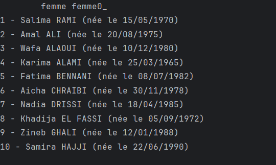
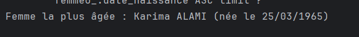
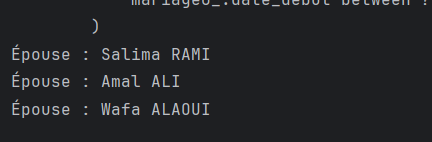
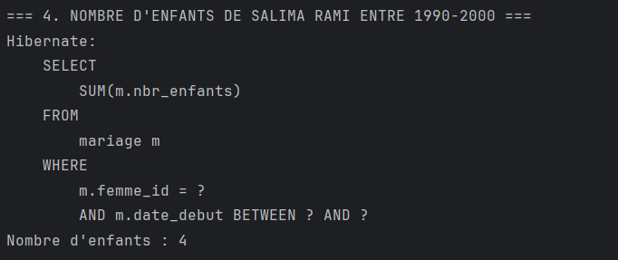
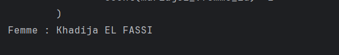
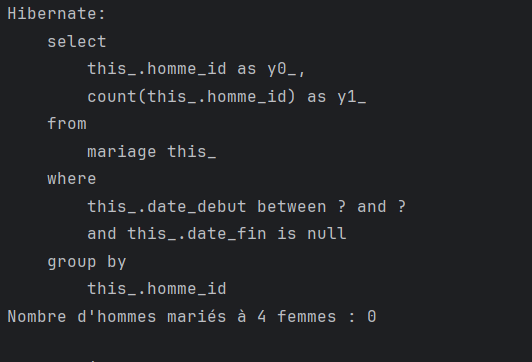
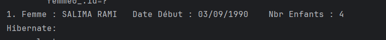

Fonctionnalités et exemples
1. Créer 10 femmes et 5 hommes

Le programme crée automatiquement 10 femmes et 5 hommes.

Exemple de sortie :

2. Afficher la liste des femmes

Affiche toutes les femmes avec leur nom et âge.

Exemple de sortie :

3. Afficher la femme la plus âgée

Calcule et affiche la femme la plus âgée.

Exemple de sortie :

4. Afficher les épouses d’un homme donné

Entrer le nom d’un homme pour afficher toutes ses épouses.

Exemple de sortie :

5. Afficher le nombre d’enfants d’une femme entre deux dates

Entrer le nom de la femme et deux dates pour calculer le nombre d’enfants nés entre ces dates.

Exemple de sortie :

6. Afficher les femmes mariées deux fois ou plus

Le programme recherche toutes les femmes ayant eu deux mariages ou plus.

Exemple de sortie :

7. Afficher les hommes mariés à quatre femmes entre deux dates

Entrer deux dates pour filtrer les hommes mariés exactement quatre fois durant cette période.

Exemple de sortie :

