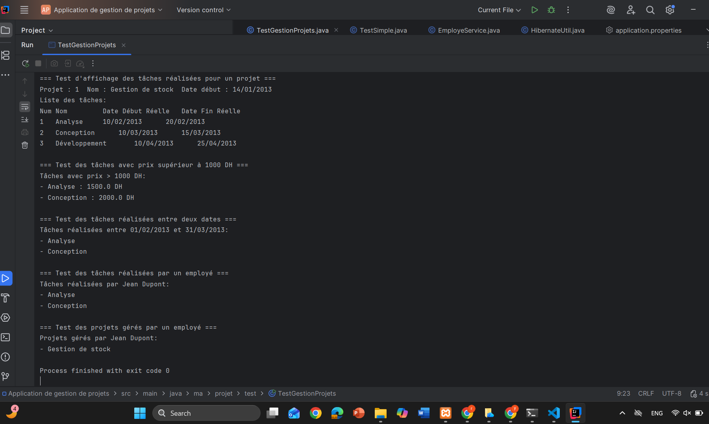

# Projet Gestion de Stock – Tâches et Requêtes

## Description
Ce projet permet de gérer des projets et leurs tâches associées.  
Fonctionnalités principales :  
- Affichage des projets et de leurs tâches  
- Affichage des tâches dont le prix est supérieur à 1000 DH via une **requête nommée**  
- Affichage des tâches réalisées entre deux dates  
- Programmes de test pour valider toutes les fonctionnalités
Exemple de sortie :
