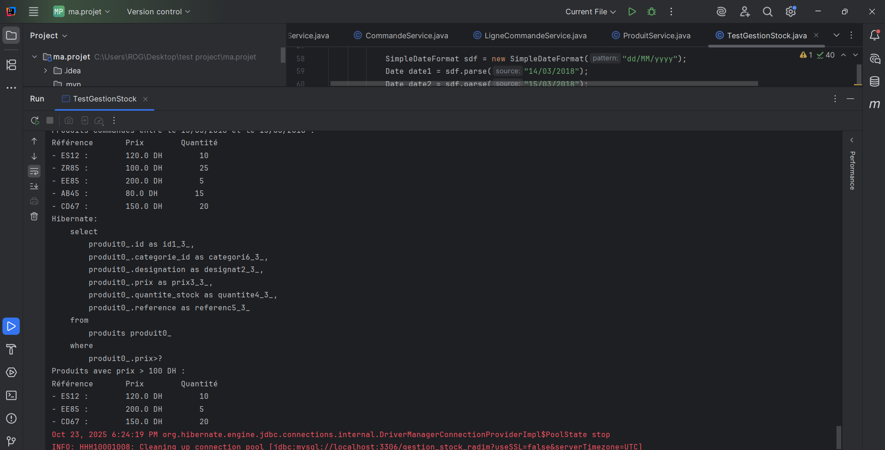
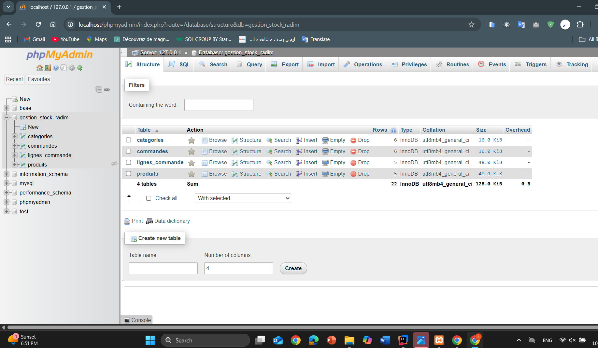

Fonctionnalités
1. Création de produits

Le programme permet de créer une liste de produits avec les informations suivantes :

Nom du produit

Prix (en DH)

Quantité

Exemple de sortie :

2. Affichage des produits dont le prix est supérieur à 100 DH

Une requête nommée est utilisée pour récupérer les produits répondant à ce critère.

Exemple  :

